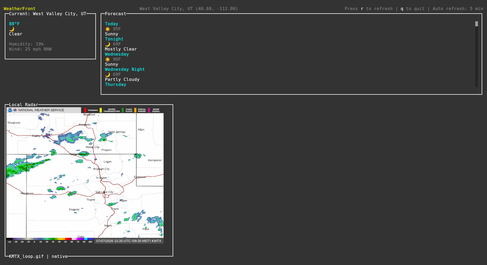

# WeatherFront

WeatherFront is a terminal-based weather dashboard that displays current conditions, detailed forecasts, and animated radar imagery, powered by the National Weather Service (NWS) API. Built with Bun and OpenTUI.



## Prerequisites

- [Bun](https://bun.sh)
- [Chafa](https://hpjansson.org/chafa/) (optional, for radar fallback rendering)

## Quick Start

```bash
git clone https://github.com/fearlessgeek/weatherfront.git
cd weatherfront
bun install
bun start
```

## Usage

Run the dashboard:

```bash
bun start
```

Auto-detect location via IP (default):

```bash
./weatherfront
```

Use specific coordinates:

```bash
./weatherfront 40.691 -112.001
```

Override the default auto-refresh interval (default: 5 minutes):

```bash
WEATHERFRONT_REFRESH_INTERVAL=60000 bun start
```

Keyboard shortcuts:

- `r` — manual refresh now
- `q` — quit

The refresh interval is shown in the top status bar.

## Installation

### Standalone Binary

```bash
bun build --compile --outfile weatherfront src/main.tsx
./weatherfront
```

### Development

```bash
bun dev
```

## Image output and radar

- Radar uses the Kitty graphics protocol when running in a Kitty terminal.
- Otherwise it falls back to terminal symbols via Chafa if available.
- Multiplexers like tmux/screen may block image protocols; run outside them for native radar rendering.
- Override the refresh interval with `WEATHERFRONT_REFRESH_INTERVAL` in milliseconds (e.g., `60000` for 1 minute, `300000` for 5 minutes).

If you find this project helpful, consider supporting its development at https://ko-fi.com/fearlessgeekmedia.
