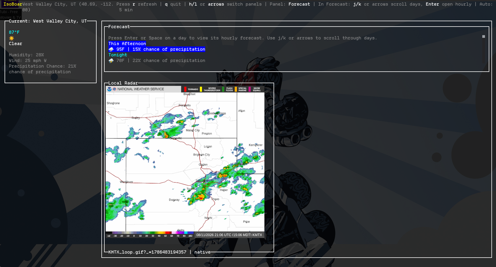

# Isoboard

The project WeatherFront has been renamed to IsoBoard, due to discovering another software project by the same name.

Isoboard is a terminal-based weather dashboard that displays current conditions, detailed forecasts, and animated radar imagery, powered by the National Weather Service (NWS) API. Built with Bun and OpenTUI.



## Prerequisites

- [Bun](https://bun.sh)
- [Chafa](https://hpjansson.org/chafa/) (optional, for radar fallback rendering)

## Quick Start

```
git clone https://github.com/fearlessgeek/isoboard.git
cd isoboard
bun install
bun start
```

## Installation

### Standalone Binary

```
bun build --compile --outfile isoboard src/main.tsx
./isoboard
```

### Development

```
bun dev
```

## Usage

Run the dashboard:

```
bun start
```

Auto-detect location via IP (default):

```
./isoboard
```

Use specific coordinates:

```
./isoboard --lat=40.691 --long=-112.001
```

Override the default auto-refresh interval in seconds (default: 300 = 5 minutes):

```
./isoboard --refresh=60
```

Keyboard shortcuts:

- `r` — manual refresh now
- `q` — quit

The refresh interval is shown in the top status bar.

## Image output and radar

- Radar uses the Kitty graphics protocol when running in a Kitty terminal.
- Otherwise it falls back to terminal symbols via Chafa if available.
- Multiplexers like tmux/screen may block image protocols; run outside them for native radar rendering.

If you find this project helpful, consider supporting its development at https://ko-fi.com/fearlessgeekmedia.
